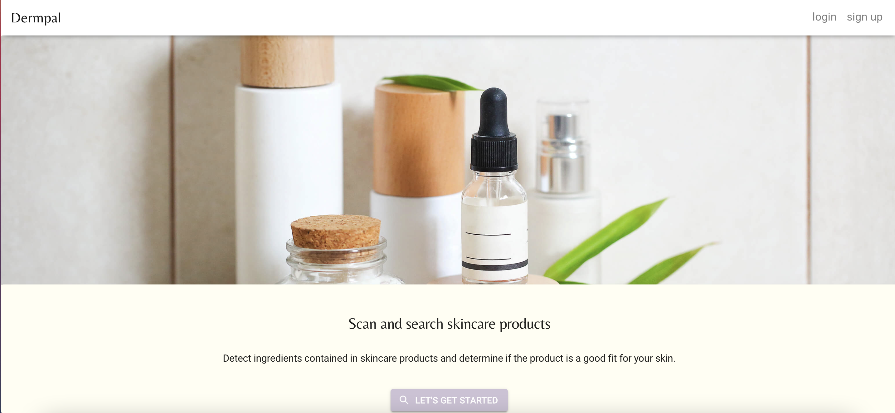
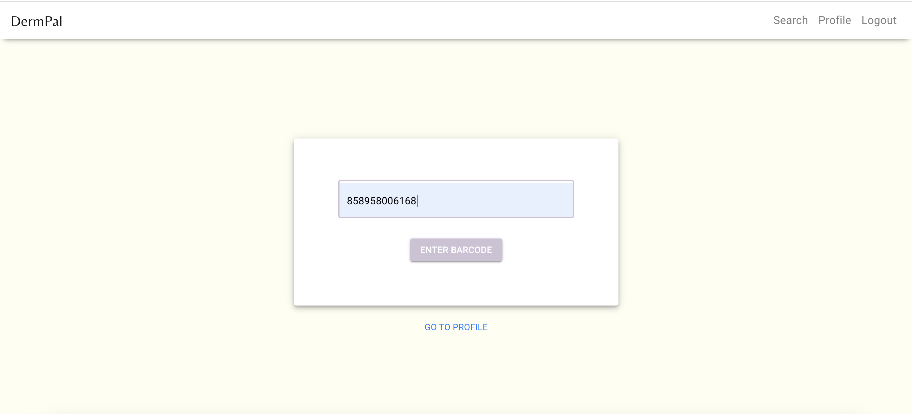
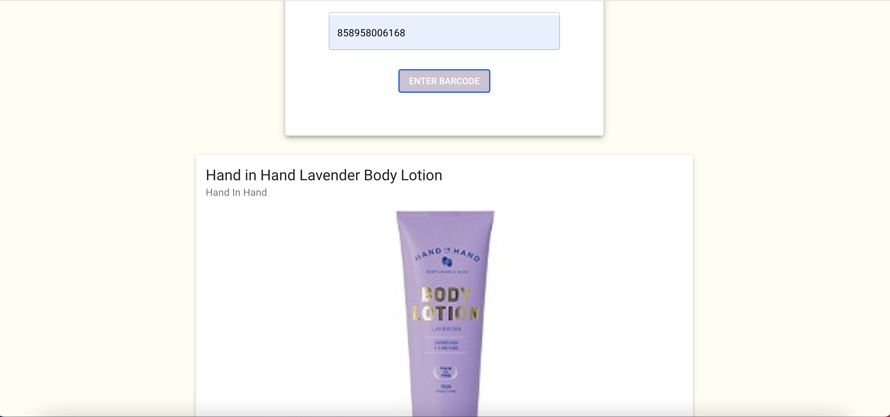
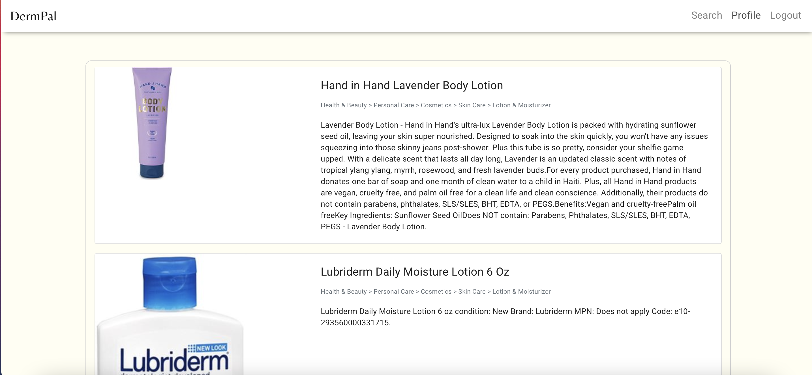

# DermPal
## Description
DermPal is a barcode scanning app that is designed to help the user find skincare products that are compatible with their skin.

 ## Table of Contents
   * [User story](#User-story)
   
   * [Features](#Features)

   * [Instructions for use ](#IInstructions-For-Use)

   * [Contributors ](#Contributors )
   
   * [Deployed dermpal URL](#Deployed-Dermpal-URL) 
     
  * [License](#license)

## User Story
As a user looking to purchase skincare products, I want to know which products are compatible with my skin. I also need a 
list of stores that sell my product and the prices it is sold at to make the most cost effective purchase.

## Features
1. Home page
 * 
1. Users can scan a barcode for any skincare product and learn about the product compatibility 
 * 
2. Users can save products they search for to a profile page and remove them
 * 
3. Users receive a complete list of stores that carry a product
 * 
## Instructions For Use 
No installations are needed to use this app. The application is deployed on Heroku.

## Contributors
1) [Andrés Roldán ](https://github.com/dresroldan)
2) [Berhane Beyene](https://github.com/Bbeyenene)
3) [Prerona Mukherjee](https://github.com/preronam)

## Deployed  Dermpal  URL
 [Application Link](https://dermpal1.herokuapp.com/)

## License
 This application is licensed under .

<!-- 

## Description
   Bookstorebm is a
   ## Table of Contents
   * [Installation Instructions](#installation-instructions)
   
   * [Usage Instructions](#usage-instructions)
   
   * [Contribution](#Contribution)
   
   * [Developers Contact Information](#Developers-Contact-Information)
     
  * [License](#license)

   ## Installation Instructions
  * [bookstorebm](https://bookstorebm.herokuapp.com/)
  * [usage instructions](#usage-instructions). Moreover, the developer is authorizing a free usage and installation by cloning from the code [Bbeyenene/bookstorebm](https://github.com/Bbeyenene/bookstorebm).
   ## Usage Instructions
   1. Home Page 
    

   2. Seach Result
    
   
   3. Saved Book
    
   
   ## Contribution
   [Bbeyenene](https://github.com/Bbeyenene) is the only contrubuter to this project.
   
   ## Developers Contact Information
   * LinkdIn Profile: [Berhane](https://www.linkedin.com/in/berhane-beyene/)
   * URL : [bookstorebm](https://bookstorebm.herokuapp.com/) 
   * Email: monoxica2004@yahoo.com
   ## License
   This application is licensed under . -->
